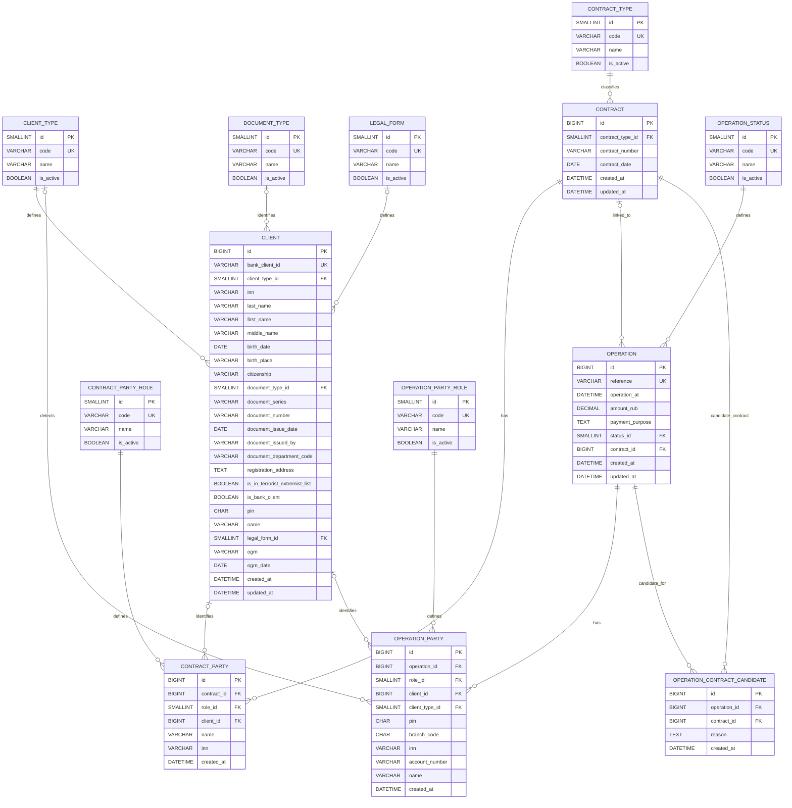

# ER-диаграмма

```mermaid
erDiagram

    CLIENT_TYPE ||--o{ CLIENT : defines
    DOCUMENT_TYPE o|--o{ CLIENT : identifies
    LEGAL_FORM o|--o{ CLIENT : defines

    CONTRACT_TYPE ||--o{ CONTRACT : classifies
    CONTRACT ||--o{ CONTRACT_PARTY : has
    CONTRACT_PARTY_ROLE ||--o{ CONTRACT_PARTY : defines
    CLIENT o|--o{ CONTRACT_PARTY : identifies

    OPERATION_STATUS ||--o{ OPERATION : defines
    CONTRACT o|--o{ OPERATION : linked_to

    OPERATION ||--o{ OPERATION_PARTY : has
    OPERATION_PARTY_ROLE ||--o{ OPERATION_PARTY : defines
    CLIENT o|--o{ OPERATION_PARTY : identifies
    CLIENT_TYPE o|--o{ OPERATION_PARTY : detects

    OPERATION ||--o{ OPERATION_CONTRACT_CANDIDATE : candidate_for
    CONTRACT ||--o{ OPERATION_CONTRACT_CANDIDATE : candidate_contract


    CLIENT_TYPE {
        SMALLINT id PK
        VARCHAR code UK
        VARCHAR name
        BOOLEAN is_active
    }

    DOCUMENT_TYPE {
        SMALLINT id PK
        VARCHAR code UK
        VARCHAR name
        BOOLEAN is_active
    }

    LEGAL_FORM {
        SMALLINT id PK
        VARCHAR code UK
        VARCHAR name
        BOOLEAN is_active
    }

    CLIENT {
        BIGINT id PK
        VARCHAR bank_client_id UK
        SMALLINT client_type_id FK
        VARCHAR inn
        VARCHAR last_name
        VARCHAR first_name
        VARCHAR middle_name
        DATE birth_date
        VARCHAR birth_place
        VARCHAR citizenship
        SMALLINT document_type_id FK
        VARCHAR document_series
        VARCHAR document_number
        DATE document_issue_date
        VARCHAR document_issued_by
        VARCHAR document_department_code
        TEXT registration_address
        BOOLEAN is_in_terrorist_extremist_list
        BOOLEAN is_bank_client
        CHAR pin
        VARCHAR name
        SMALLINT legal_form_id FK
        VARCHAR ogrn
        DATE ogrn_date
        DATETIME created_at
        DATETIME updated_at
    }

    CONTRACT_TYPE {
        SMALLINT id PK
        VARCHAR code UK
        VARCHAR name
        BOOLEAN is_active
    }

    CONTRACT {
        BIGINT id PK
        SMALLINT contract_type_id FK
        VARCHAR contract_number
        DATE contract_date
        DATETIME created_at
        DATETIME updated_at
    }

    CONTRACT_PARTY_ROLE {
        SMALLINT id PK
        VARCHAR code UK
        VARCHAR name
        BOOLEAN is_active
    }

    CONTRACT_PARTY {
        BIGINT id PK
        BIGINT contract_id FK
        SMALLINT role_id FK
        BIGINT client_id FK
        VARCHAR name
        VARCHAR inn
        DATETIME created_at
    }

    OPERATION_STATUS {
        SMALLINT id PK
        VARCHAR code UK
        VARCHAR name
        BOOLEAN is_active
    }

    OPERATION {
        BIGINT id PK
        VARCHAR reference UK
        DATETIME operation_at
        DECIMAL amount_rub
        TEXT payment_purpose
        SMALLINT status_id FK
        BIGINT contract_id FK
        DATETIME created_at
        DATETIME updated_at
    }

    OPERATION_PARTY_ROLE {
        SMALLINT id PK
        VARCHAR code UK
        VARCHAR name
        BOOLEAN is_active
    }

    OPERATION_PARTY {
        BIGINT id PK
        BIGINT operation_id FK
        SMALLINT role_id FK
        BIGINT client_id FK
        SMALLINT client_type_id FK
        CHAR pin
        CHAR branch_code
        VARCHAR inn
        VARCHAR account_number
        VARCHAR name
        DATETIME created_at
    }

    OPERATION_CONTRACT_CANDIDATE {
        BIGINT id PK
        BIGINT operation_id FK
        BIGINT contract_id FK
        TEXT reason
        DATETIME created_at
    }
```
